# indiv_proj3_yx248 Databricks ETL Pipeline Project - Diamond Data Analysis

## Overview
This project demonstrates an end-to-end Extract, Transform, Load (ETL) pipeline using Databricks, Delta Lake, and Spark SQL. It focuses on extracting diamond data, transforming it for efficient analysis, and loading it into a structured format. The project also includes data validation, error handling, and visualization for insightful analysis.

## Prerequisites
- Basic understanding of SQL and Python
- An active Databricks account
- Access to Databricks datasets
- Databricks Workspace
- A configured Databricks cluster with Spark and Delta Lake support
- Basic knowledge of PySpark and Spark SQL

## Project Structure
1. **Extract_and_Transform_Load_Diamonds_Data Notebook**: This notebook handles data extraction from a CSV file and its transformation into Delta format.
2. **Transform_Load_Diamonds_Data Notebook**: Focused on further data transformations and aggregations.
3. **Data_Query_and_Visualization Notebook**: Dedicated to querying the transformed data and visualizing insights.

## Project Structure
The ETL pipeline consists of Two primary notebooks:
1. `Extract_and_Transform_Load_Diamonds_Data`:
    - Extracts and loads data into Delta Lake.
    - Transforms the data and performs aggregations.
2. `Data_Query_and_Visualization`:
    - Queries the transformed data and visualizes insights.

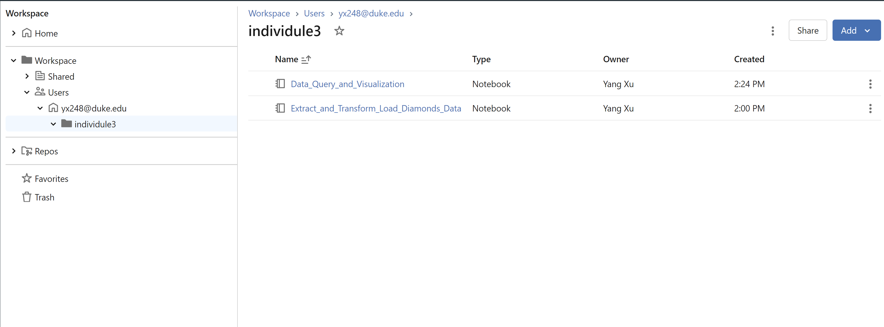

## Step-by-Step Guide

### Step 1: Extract and Transform Data
Initialize the extraction and transformation process by dropping any existing table and creating a new one.

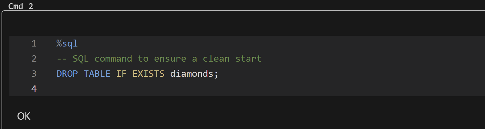

### Step 2: Setting Up Spark Session
Start by setting up a Spark session in Databricks to process the data.

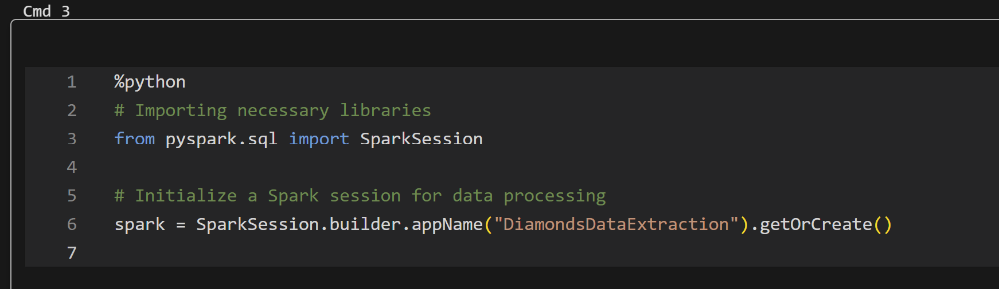

### Step 3: Load and Display Dataset
Load the diamonds dataset from the CSV file provided in the Databricks datasets and display the first few rows to ensure correct extraction.

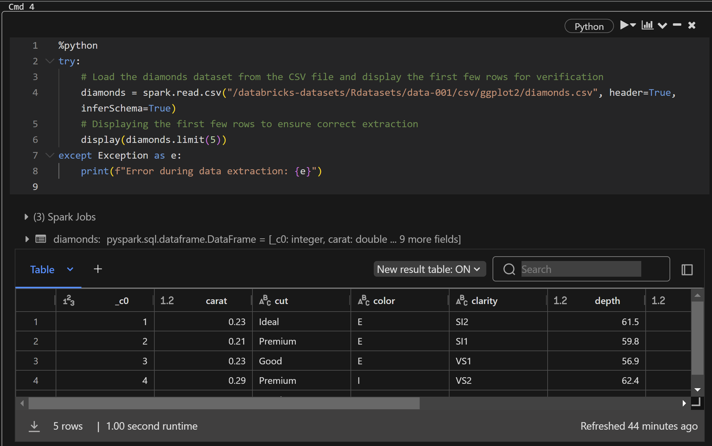

The complete DBFS directory structure and files can be viewed in Data Ingestion

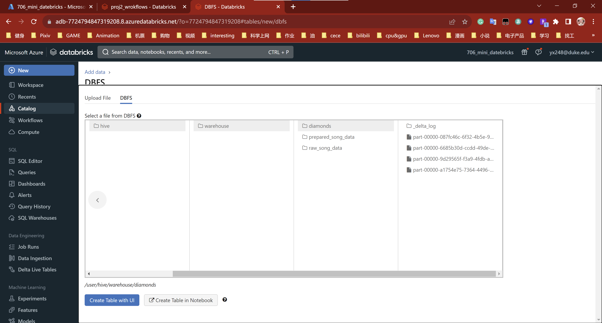

### Step 4: Data Transformation
Transform the extracted dataset into Delta format for efficient processing and storage.

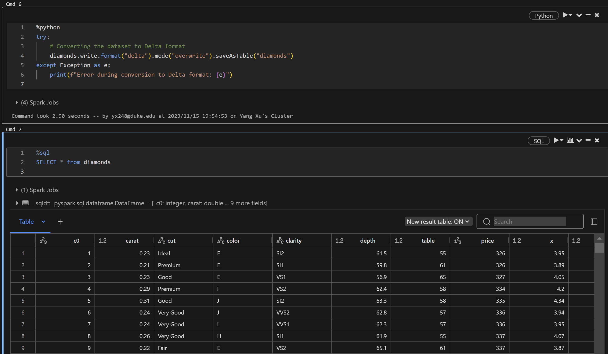

### Step 5: Validate Data
Perform data validation checks to ensure data quality and integrity.

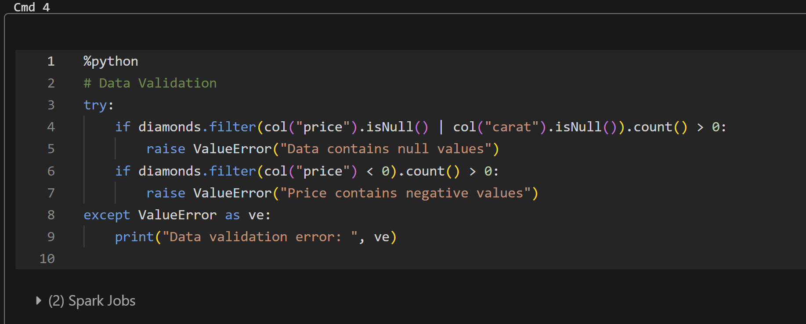

### Step 6: Query and Visualize Data
Query the Delta table and visualize the results using both SQL and PySpark.

#### Read Data Table into Dataframe
Before use the data in table for python, need to read data table into dataframe by spark.

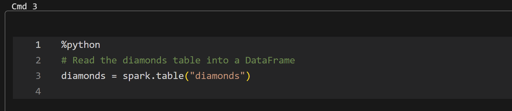

#### SQL Visualization
Visualize the average price of diamonds by color using SQL.

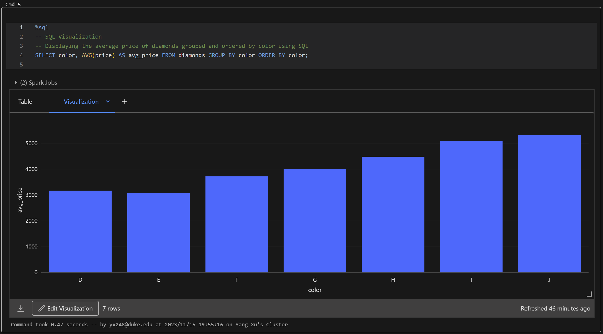

#### Python Visualization
Create a visual representation using PySpark.

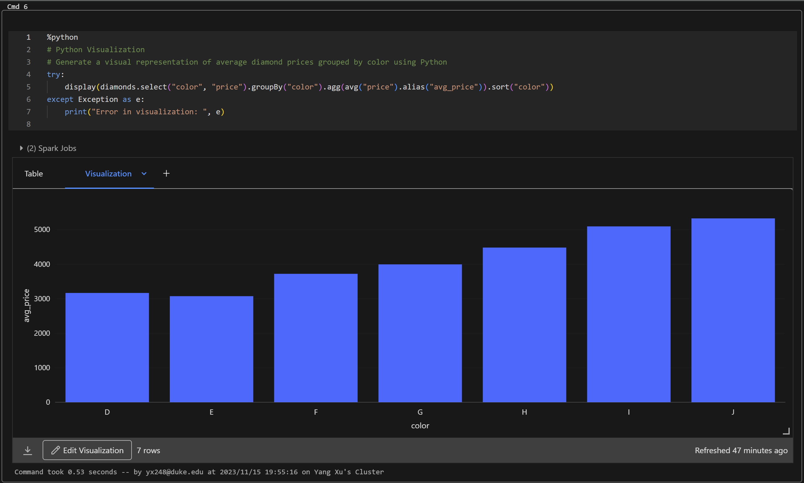

## Automated Workflow Pipeline

The ETL pipeline is automated using Databricks Jobs and Workflows. Below are the steps to set up and monitor the automated workflow pipeline, along with screenshots for visual guidance.

### Setting Up the Automated Trigger

1. **Navigate to the Workflows section** in your Databricks workspace.
2. **Create a new job** by selecting the notebooks that constitute the ETL pipeline.
3. **Configure the trigger settings** by specifying the trigger type and schedule.

   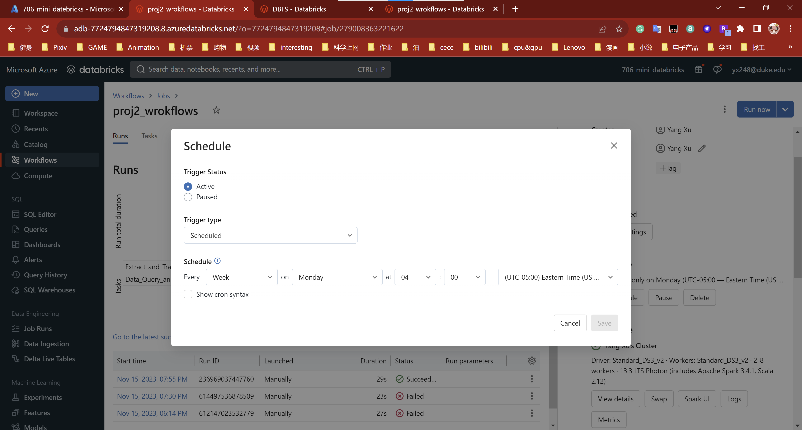

### Monitoring Workflow Runs

1. **Check the status of workflow runs** to monitor the ETL jobs.
2. **Inspect successful and failed runs** for troubleshooting and performance analysis.

   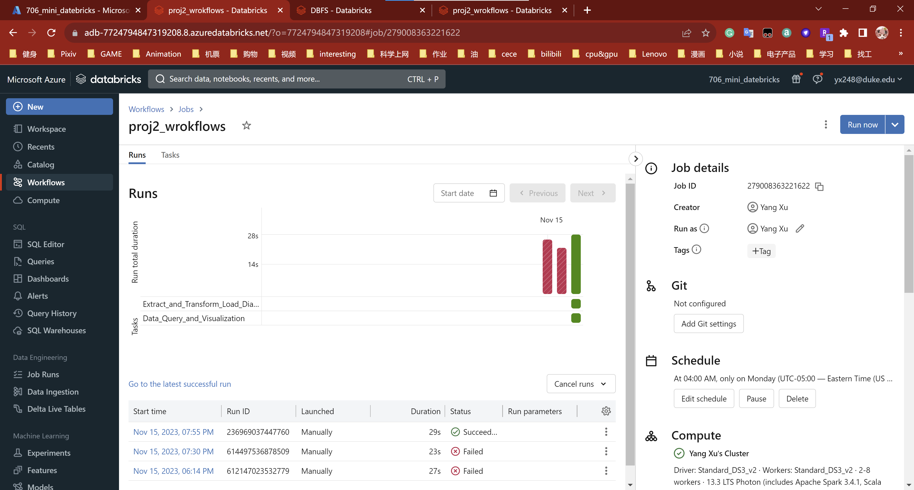

### Workflow Tasks Overview

1. **View the tasks** associated with your workflow for a high-level overview of the pipeline.
2. **Monitor the progress and dependencies** of each task within the workflow.

   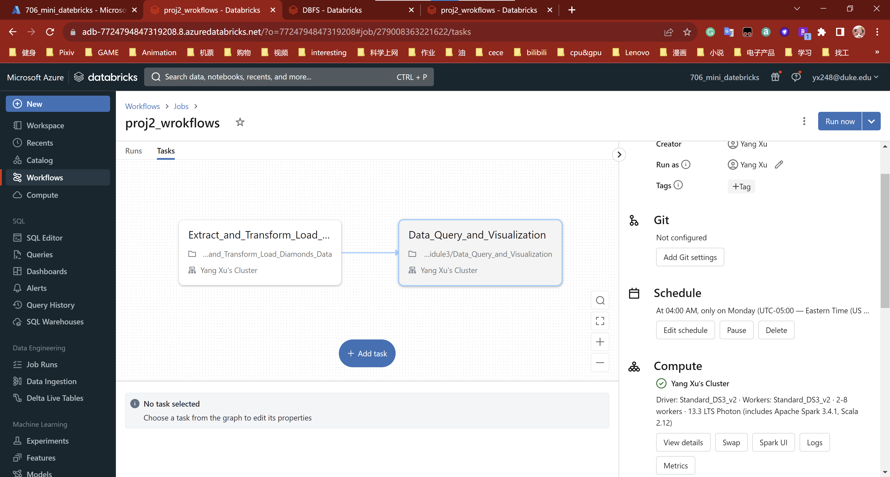

## Running the Automated Pipeline

After setting up the trigger, the ETL pipeline will run automatically according to the schedule you've specified. You can monitor the workflow runs and manage the job settings from the Workflows section of the Databricks UI.

## Conclusion

The Databricks ETL pipeline with Delta Lake and Spark SQL offers a robust solution for processing and analyzing diamond data. The added automation and visualization enable a seamless workflow for end-to-end data handling, from extraction to actionable insights.

For any queries or further assistance, please refer to the Databricks documentation or reach out to the support team.
